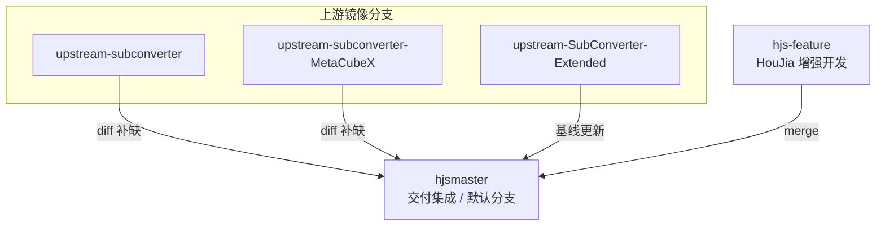

# SubConverter-Extended 分支模型与上游同步（HouJia）

> [!CAUTION]
> **本文档已迁移。** 请以 **[HouJia/SubConverter-Extended](https://github.com/HouJia/SubConverter-Extended)** `hjsmaster` 下同名文件为准。  
> 入口索引：[docs/00-请移步-SubConverter-Extended.md](00-请移步-SubConverter-Extended.md)

> **仓库（唯一交付仓）**：[HouJia/SubConverter-Extended](https://github.com/HouJia/SubConverter-Extended)  
> **Extended 官方上游**：[Aethersailor/SubConverter-Extended](https://github.com/Aethersailor/SubConverter-Extended)  
> **关联只读参考**：[tindy2013/subconverter](https://github.com/tindy2013/subconverter)、[MetaCubeX/subconverter](https://github.com/MetaCubeX/subconverter)  
> **版本**：2026-05-28（自 `HouJia/subconverter` 迁入本仓库）

## 目录

- [1. 目标与分支总览](#1-目标与分支总览)
- [2. 分支职责](#2-分支职责)
- [3. 远程与跟踪关系](#3-远程与跟踪关系)
- [4. 日常迭代流程（hjs-feature → hjsmaster）](#4-日常迭代流程hjs-feature--hjsmaster)
- [5. 功能关系与合并策略](#5-功能关系与合并策略)
- [6. 同步 tindy 上游](#6-同步-tindy-上游)
- [7. 同步 MetaCubeX 上游](#7-同步-metacubex-上游)
- [8. 同步 Aethersailor Extended 上游](#8-同步-aethersailor-extended-上游)
- [9. NAS 部署](#9-nas-部署)
- [10. 从 HouJia/subconverter 迁入说明](#10-从-houjiasubconverter-迁入说明)

## 1. 目标与分支总览

在 **SubConverter-Extended 代码基线** 上，保留 NAS 自建能力，并持续吸收 tindy / MetaCubeX 的必要能力（**diff 补缺**，非整分支 merge）。



- **默认分支**：`hjsmaster`（GitHub + NAS 构建均以此为准）
- **自建开发**：`hjs-feature`（仅 HouJia 增强；合并进 `hjsmaster` 后部署）

## 2. 分支职责

| 分支 | 职责 |
|------|------|
| **`hjsmaster`** | **交付集成主分支**：Extended 基线 + 三路上游能力补缺 + 已合并的 `hjs-feature` |
| **`hjs-feature`** | **HouJia 增强开发分支**：NAS、`+houjia.N` 版本、协议补丁、文档等；验证后 merge 到 `hjsmaster` |
| **`upstream-subconverter`** | tindy `master` 镜像 |
| **`upstream-subconverter-MetaCubeX`** | MetaCubeX `master` 镜像 |
| **`upstream-SubConverter-Extended`** | Aethersailor `master` 镜像（Extended 官方基线快照） |
| `hjsmaster-blk` | 旧 tindy 集成主线备份（只读参考，不部署） |

**禁止**：在 `upstream-*` 镜像分支上直接做 NAS / houjia 提交。

## 3. 远程与跟踪关系

```bash
git remote -v
# origin    git@github.com:HouJia/SubConverter-Extended.git
# upstream  git@github.com:Aethersailor/SubConverter-Extended.git
# tindy     git@github.com:tindy2013/subconverter.git
# metacubex git@github.com:MetaCubeX/subconverter.git
```

| Remote | 用途 |
|--------|------|
| `origin` | 推送 `hjsmaster`、`hjs-feature`、镜像分支 |
| `upstream` | 更新 `upstream-SubConverter-Extended` |
| `tindy` | 更新 `upstream-subconverter` |
| `metacubex` | 更新 `upstream-subconverter-MetaCubeX` |

首次配置示例：

```bash
git remote add tindy git@github.com:tindy2013/subconverter.git
git remote add metacubex git@github.com:MetaCubeX/subconverter.git
# upstream 通常已指向 Aethersailor
```

## 4. 日常迭代流程（hjs-feature → hjsmaster）

### 4.1 新功能 / 修复（HouJia 自建）

```bash
git checkout hjs-feature
git pull origin hjs-feature
# … 编辑、测试 …
git commit -m "feat(nas): …"
git push origin hjs-feature

git checkout hjsmaster
git merge hjs-feature -m "merge: hjs-feature …"
git push origin hjsmaster

./deploy/nas/deploy-to-qnap.sh   # 本机 Docker → NAS
```

### 4.2 原则

- **所有 HouJia 增强**优先提交在 **`hjs-feature`**，避免与上游同步提交混杂。
- **`hjsmaster`** 始终可部署；合并前在本地或 NAS 验证构建。
- 版本号 bump（`1.1.9+houjia.N`）在 `hjs-feature` 改，`merge` 后进 `hjsmaster` 再部署。

## 5. 功能关系与合并策略

三路上游 **无共同 Git 祖先**，无法对 Extended 做常规三路 merge。

| 方式 | 含义 |
|------|------|
| **Extended 为代码基线** | 源码树以 `upstream-SubConverter-Extended` / Aethersailor master 为准 |
| **diff 补缺** | 对比 tindy、MetaCubeX 镜像，**逐项移植**补丁到 `hjs-feature` 或 `hjsmaster` |
| **hjs 自建** | `deploy/nas/*`、`maxAllowedRulesets=256`、`?ua=`、Hy2 `server_ports` / `hop_interval` 等 |

## 6. 同步 tindy 上游

```bash
git fetch tindy master
git checkout upstream-subconverter
git merge --ff-only tindy/master
git push origin upstream-subconverter

git checkout hjs-feature   # 或 hjsmaster，视补丁归属
# diff upstream-subconverter → 移植必要补丁 → commit
git checkout hjsmaster
git merge hjs-feature
git push origin hjsmaster
```

冲突时 **保留** `deploy/`、`docs/`、`pref.toml`、houjia 模板。

## 7. 同步 MetaCubeX 上游

```bash
git fetch metacubex master
git checkout upstream-subconverter-MetaCubeX
git merge --ff-only metacubex/master
git push origin upstream-subconverter-MetaCubeX

# diff 补缺 → hjs-feature → merge hjsmaster（同 §6）
```

## 8. 同步 Aethersailor Extended 上游

```bash
git fetch upstream master
git checkout upstream-SubConverter-Extended
git merge --ff-only upstream/master
git push origin upstream-SubConverter-Extended

git checkout hjsmaster
git merge upstream-SubConverter-Extended -m "merge(extended): sync Aethersailor master"
# 解决冲突：保留 deploy/nas、houjia 层；再 merge/rebase hjs-feature 若需要
git push origin hjsmaster
```

Extended 大版本更新后，建议 **`git rebase upstream-SubConverter-Extended`** 或 merge 到 `hjs-feature` 再合 `hjsmaster`。

## 9. NAS 部署

**推荐（本机 Docker 交叉构建）**：

```bash
./deploy/nas/deploy-to-qnap.sh
```

详见 [技术迭代-NAS部署与NPM暴露.md](./技术迭代-NAS部署与NPM暴露.md)。

- 生产镜像 **仅** 从 **`hjsmaster`** 构建。
- sub-web 配套仓库：[HouJia/sub-web](https://github.com/HouJia/sub-web) 分支 **`hjsmaster`**。

## 10. 从 HouJia/subconverter 迁入说明

2026-05-28 起，原 [HouJia/subconverter](https://github.com/HouJia/subconverter) 的 `hjsmaster`、三路上游镜像分支与文档 **迁入本仓库**。

| 原仓库 | 现仓库 |
|--------|--------|
| `HouJia/subconverter` `hjsmaster` | **`HouJia/SubConverter-Extended` `hjsmaster`** |
| 新建 | **`hjs-feature`**（HouJia 增强迭代） |
| `upstream-*` 镜像分支 | 同名迁入本仓库 |

**`HouJia/subconverter`**：归档只读，新提交请 push 到 **本仓库**。

---

**维护**：变更分支模型时同步更新本文与 `README.md`。
